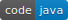

  

# Map Notes

An Android application which allows you to add/remove notes to the current location 

 

 

## Frameworks and Tools

* Android SDK
* Firebase Authentication
* Firebase Realtime Database
* Firebase Crashlytics
* Firebase Analytics
* Google Maps
* Service Location
* Robolectric
* Mockito
* Espresso
* RxJava2 
* Dagger2

## Configuration
Configuration requires Firebase Project and Google Maps SDK, see [installation guide](doc/installation_guide.md) for the details.

## Features
* Creating account/Login/ Log out, use email, password and user name

* Adding public notes with current location (notes will be available to other users)

* Removing notes by swipe left, right in search mode (added to original project)

* Search by Notes/Users

* Notes overview on the map

* Interaction mode of the map

* Adding markers to the map by search screen

* Removing all markers by pressing "back"

  

## Get Started

Setup Firebase Project and Google Maps SDK for Android according to [installation guide](doc/installation_guide)

Build and run application. 

Open Sign Up Screen. Enter name, email and password. Press "Sign Up" button

Google Maps will open and show current location of the device.

Press "Add Note" button and enter "Google Plex" label of note and press "**ADD**" button

Location marker will appear on Map. Press "Search Notes" button. The list of notes will be displayed.

Swipe note right or left to delete.

## Unit Tests
Unit tests based on Robolectric and Mockito frameworks added to application, see [unit tests guide](doc/unit_tests_guide.md) for the details. More than 200+ unit test methods were created. Run all unit tests with RMB click on [RunUnitTests](app/src/test/java/ru/vpcb/map/notes/RunUnitTests.java) 

## Instrumentation Tests

Instrumentation and Smoke tests based on Espresso and Mockito frameworks were designed for application.

Two  different ways of component mocking were implemented in this application. 

- **master** branch uses IModuleSupplier that provide test module "on the fly" why component creation. 
- **builders** branch uses Map<Activity,SubComponent.Builder> to replace builder with mocked one.

For the details  on instrumentation tests look at [instrumentation tests guide](doc/instrumentation_tests_guide.md) for **master** and [instrumentation tests builders guide](doc/instrumentation_tests_builders_guide.md) for **builders** branches.

For the details  on smoke tests look at [smoke tests guide](doc/smoke_tests_guide.md) for **master** and [ismoke_tests builders guide](doc/smoke_tests_builders_guide.md) for **builders** branches.

More than 30+ instrumentation  test methods were created. Run all instrumentation tests with RMB click on 'Run'  [RunInstrumentationTests](app/src/androidTest/java/ru/vpcb/map/notes/RunInstrumentationTests.java) or [SmokeTests](app/src/androidTest/java/ru/vpcb/map/notes/SmokeTests.java). 

## Copyrights

This project is java/rxJava2/dagger2 clone of [MapNotes](https://github.com/AlexZhukovich/MapNotes) project based on kotlin/coroutines/koin created by [Alex Zhukovich](https://github.com/AlexZhukovich/)

