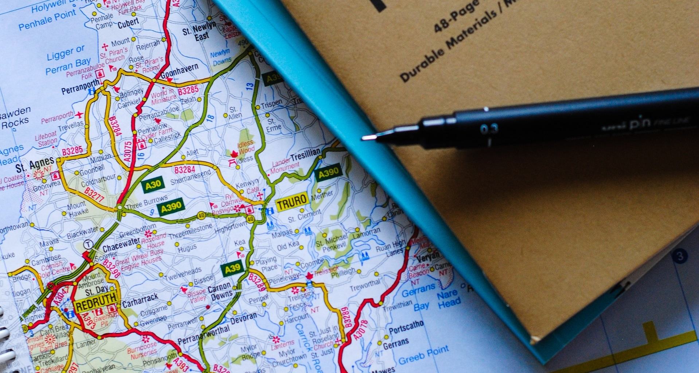

  




# Map Notes

An Android application which allows you to add/remove notes to the current location   

 

## Frameworks and Tools

* Android SDK
* Firebase Authentication, Realtime Database, Storage, Analytics, Crashlytics
* Google Play Services Authentication
* Google Maps SDK
* Fused Location Provider API
* Jetpack Architecture Components
* Kotlin Coroutines 
* Hilt
* Material Design 3

## Features

* Single activity multiple fragments MVVM architecture follows the [official architecture guidance](https://developer.android.com/topic/architecture)
* ViewModels intensively used for control logic of Fragments and Activity
* Firebase Authentication  email/password sign in, sign up, password restore
* Google One Tap with Firebase Authentication sign in 
* Remote repository based on Frirebase Realtime Database and Firebase Storage 
* Local repository based on Room used to cache  remote repository data
* Kotlin Coroutines,  StateFlow, SharedFlow  perform all asynchronous operations and data transfers 
* Kotlin [suspend cancellable coroutines](https://kotlinlang.org/docs/cancellation-and-timeouts.html#timeout) and [callback flow](https://kotlinlang.org/api/kotlinx.coroutines/kotlinx-coroutines-core/kotlinx.coroutines.flow/callback-flow.html) with  [coroutine exception handler](https://kotlinlang.org/docs/exception-handling.html) used to translate Firebase callback API to coroutines
* Jetpack Navigation uses two graphs for navigation main graph and bottom sheet fragments graph
* Jetpack Databinding and Binding Adapters provide dynamic data to fragment layouts
* [Encrypted Shared Preferences](https://developer.android.com/topic/security/data) provides a secure way to store sensitive data in  Shared Preferences
* ListAdapter with DiffUtils implement optimized RecyclerView Adapter
* [Predictive back gesture navigation](https://developer.android.com/guide/navigation/custom-back/predictive-back-gesture) for Android 13 implemented for custom back navigation
* Fused Location Client uses static Broadcast Receiver for location updates
* Automatic detection with [Connectivity Manager](https://developer.android.com/training/basics/network-ops/reading-network-state)  active and metered network connection 
* [State machine pattern](https://en.wikipedia.org/wiki/Finite-state_machine) used for requesting Runtime Permissions and Location Settings
* SplashScreen API used for splash screen implementation
* Hilt dependency injection used all around app in Activity, Fragments, Broadcast Receiver, ViewModels
* Design follows Material Design 3 [recommendations](https://m3.material.io/), support light, dark themes and [dynamic colors](https://m3.material.io/styles/color/dynamic-color/overview)

## Get Started

Setup Firebase Project and Google Maps SDK for Android according to [installation guide](doc/installation_guide)

Build and run application. 

Open Sign Up Screen. Enter name, email and password. Press "Sign Up" button

Google Maps will open and show current location of the device.

Press "Add Note" button and enter "Google Plex" label of note and press "**ADD**" button

Location marker will appear on Map. Press "Search Notes" button. The list of notes will be displayed.

Swipe note right or left to delete.


## License

```
Copyright 2023.

Licensed under the Apache License, Version 2.0 (the "License");
you may not use this file except in compliance with the License.
You may obtain a copy of the License at

   http://www.apache.org/licenses/LICENSE-2.0

Unless required by applicable law or agreed to in writing, software
distributed under the License is distributed on an "AS IS" BASIS,
WITHOUT WARRANTIES OR CONDITIONS OF ANY KIND, either express or implied.
See the License for the specific language governing permissions and
limitations under the License.
```

