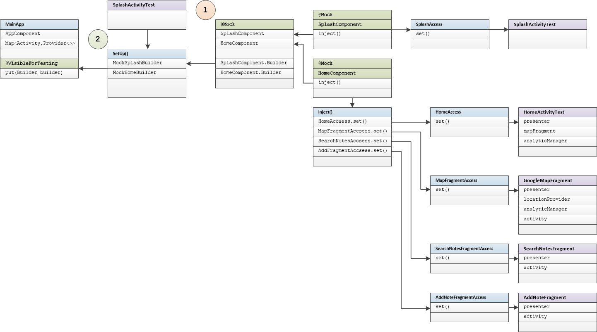
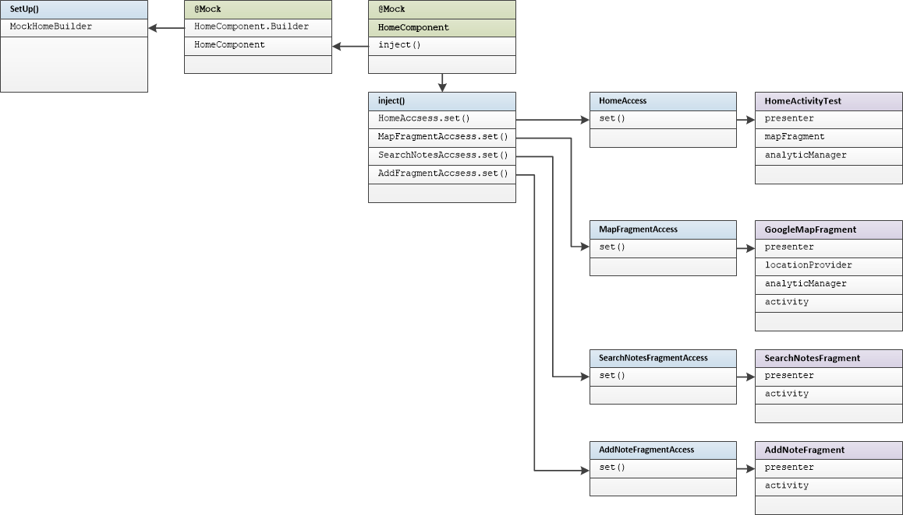

# Instrumentation Tests Guide Builders

#### Introduction:

Instrumentation tests run on real device or emulator. They  extensively use mock instances of real objects. Instrumentation tests have been  created for activities and fragments.

Test method names include input and output action description

For example:

```
whenSignOutShouldOpenLoginScreen
```

- input 		sign out  done
- output	  login screen opens

#### Tested Activities:  

- SplashActivity, LoginActivity, SignInActivity, SignUpActivity, HomeActivity

#### Tested Fragments:

- AddNoteFragment,  NoLocationPermissionFragment,  SearchNotesFragment

#### Mock Dependency Inject Scheme:  

Main Application uses Multibinding and SubComponent.Builder interface for Component/Module dependency injection.

Method put() in the MainAp  is used for SubComponent.Builder replacement during tests. @VisibleForTesting annotation makes method put() visible during tests only.

Instrumentation Tests are based on the "SubComponent.Builder replacement" scheme:

- SetUp() method creates Mock instance of target SubComponent.Builder. The build() method of this builder returns Mock Component instance
- Mock Component inject() method is used to assign desired mock objects to target activity or fragment
- Helper classes, like HomeAccess. SplashAccess and so on provides access to @Inject fields of target Activity or Fragment. These helpers are placed in the same package with activity or fragments. All @Inject fields in application have "default" package visibility.
- Mock Subcomponent.Builder instance stores to Map<> collection with MainApp method put()
- When components are created, Map<> provides SubComponent.Builders  for them.

**SplashActivityTest dependency scheme example:**

1. Create Mock Component and Mock SubComponent.Builder instances. Setup all mocked methods.
2. Put Mock SubComponent.Builder object to Application Map<Activity,SubComponent.Builder> collection



#### SetUp() method

Every Instrumentation Test class inherits MockTest class.

SetUp() method of MockTest creates SubComponent.Builder for HomeComponent and put it to Application Map<> collection.  This builder is used in the most of instrumentation tests.

This is the same for all Instrumentation Test Classes



### Instrumentation Tests for Activities  

#### SplashActivity Tests

```
    @Test
    public void whenUserIsAuthenticatedShouldOpenHomeActivity() {
    }

    @Test
    public void whenUserIsNotAuthenticatedShouldOpenHomeActivity() {
    }
```

 

See [source](../app/src/androidTest/java/ru/vpcb/map/notes/activity/splash/SplashActivityTest.java) for tests source code.

#### HomeActivity Tests

Test methods
```
    public void shouldVerifyAllTabs() {
    }

    @Test
    public void shouldVerifyAddNoteFragment() {
    }

    @Test
    public void shouldVerifySearchNoteFragment() {
    }

    @Test
    public void whenMovingFromAddTabShouldVerifyMapFragment() {
    }

    @Test
    public void whenSignOutShouldOpenLoginScreen() {
    }
```
Test scheme:
 

See [source](../app/src/androidTest/java/ru/vpcb/map/notes/activity/home/HomeActivityTest.java) for tests source code.

#### LoginActivity Tests

Test methods
```
    @Test
    public void whenClickToSignInButtonShouldLaunchSignInActivity() {
    }

    @Test
    public void whenClickToSignUpButtonShouldLaunchSignUpActivity() {
    }
```

Test scheme:

 

See [source](../app/src/androidTest/java/ru/vpcb/map/notes/activity/login/LoginActivityTest.java) for test source code.

#### SignInActivity Tests

Test methods

```
    @Test
    public void whenEmailIsEmptyShouldDisplayEmailError() {
    }

    @Test
    public void whenEmailIsNotCorrectShouldDisplayEmailError() {
    }

    @Test
    public void whenPasswordIsEmptyShouldDisplayPasswordError() {
    }

    @Test
    public void whenSignInErrorShouldDisplaySignInError() {
    }

    @Test
    public void whenSignInSuccessShouldOpenMapScreen() {
    }
```
Test scheme:

 

See [source](../app/src/androidTest/java/ru/vpcb/map/notes/activity/login/signin/SIgnInActivityTest.java) for test source code.

#### SignUpActivity Tests

Test methods:

```
    @Test
    public void whenEmailIsEmptyShouldDisplayEmailError() {
    }

    @Test
    public void whenEmailIsNotCorrectShouldDisplayEmailError() {
  
    }

    @Test
    public void whenPasswordIsEmptyShouldDisplayPasswordError() {
    }

    @Test
    public void whenNameIsEmptyShouldDisplayNameError() {
    }

    @Test
    public void whenSignUpErrorShouldDisplaySignUpError() {
    }

    @Test
    public void whenSignUpSuccessShouldOpenMapScreen() {
    }
```

Test scheme:

 

See [source](../app/src/androidTest/java/ru/vpcb/map/notes/activity/login/signup/SignUpActivityTest.java) for test source code.


### Instrumentation Tests for Fragments

#### AddNoteFragment Tests

Test methods:

```
    public void shouldDisplayNoteHintForANewNote() {
    }

    @Test
    public void shouldChangeAddButtonEnableAfterChangingNoteText() {
    }

```

Test scheme:


See [source](../app/src/androidTest/java/ru/vpcb/map/notes/fragments/add/AddNoteFragmentTest.java) for test source code.

#### NoLocationPermissionFragment Tests

Test methods:
```
    @Test
    public void shouldVerifyLayoutOfFragment() {
    }

    @Test
    public void shouldVerifyOpeningAppPreferences() {
    }

```
Test scheme:


See [source](../app/src/androidTest/java/ru/vpcb/map/notes/fragments/nopermissions/NoLocationPermissionFragmentTest.java) for test source code.

#### SearchNotesFragment Tests

Test methods:

```
    @Test
    public void shouldVerifyLayout() {
    }

    @Test
    public void shouldDisplayNotes() {
    }

    @Test
    public void shouldDisplayUnknownUserUser() {
    }

    @Test
    public void shouldSearchByUserAndDisplayResults() {
    }

    @Test
    public void shouldSearchByNotesAndDisplayResult() {
    }

    @Test
    public void whenClearRequestShouldSearchIncorrectDataAndDisplayCorrectData() {
    }

```

Test scheme:


See [source](../app/src/androidTest/java/ru/vpcb/map/notes/fragments/search/SearchNotesFragmentTest.java) for test source code.


