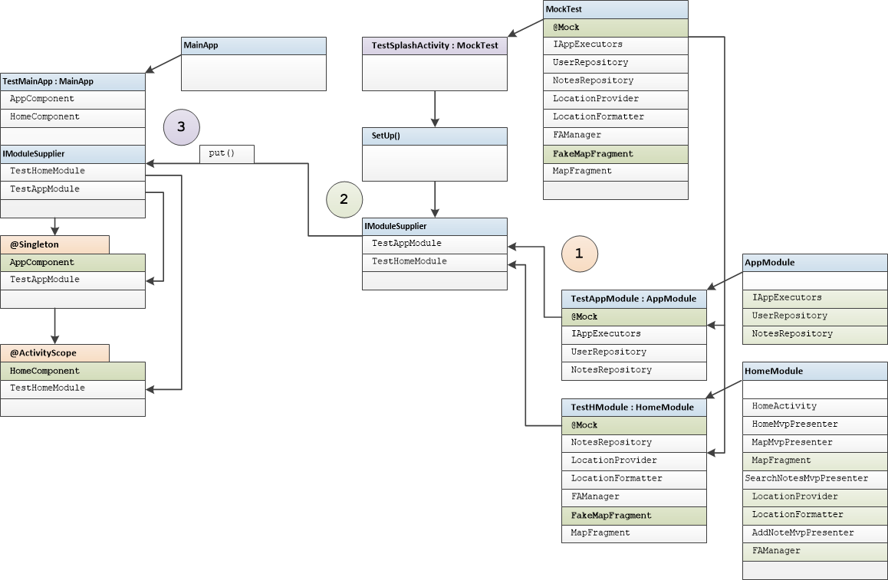
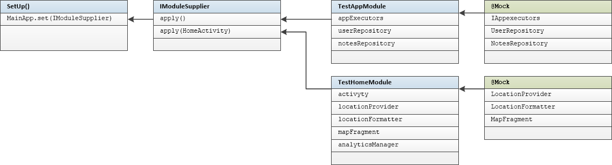
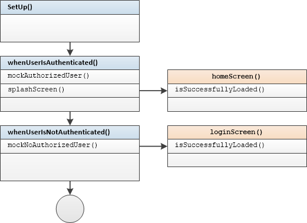
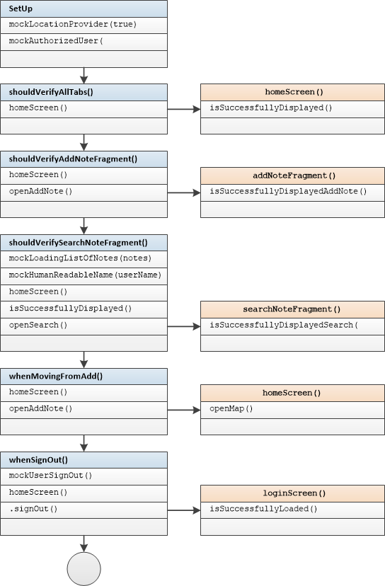
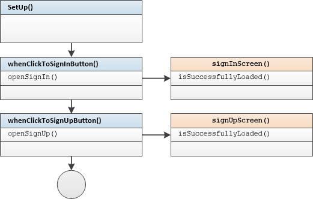
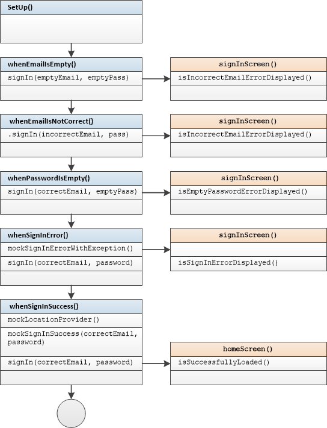
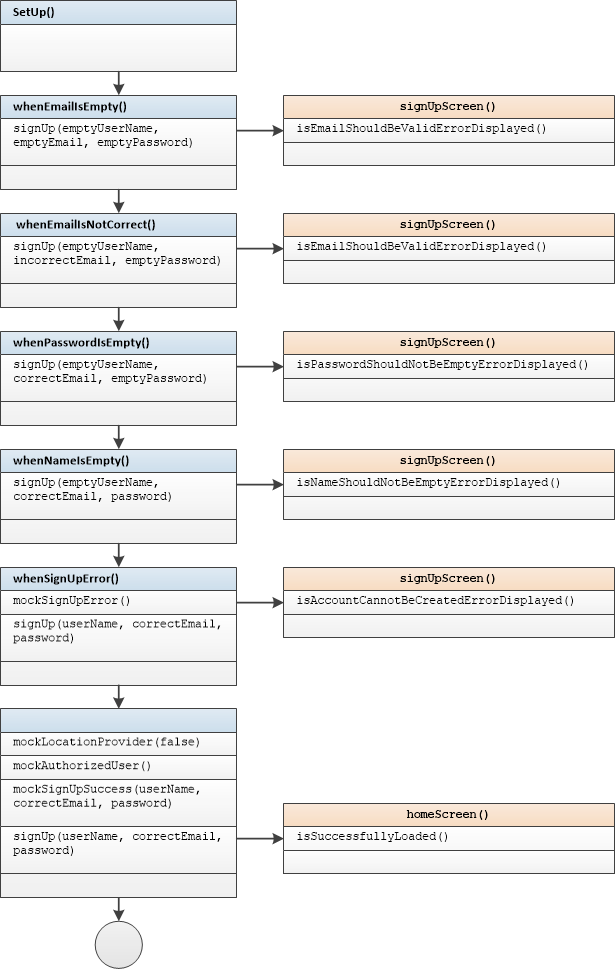
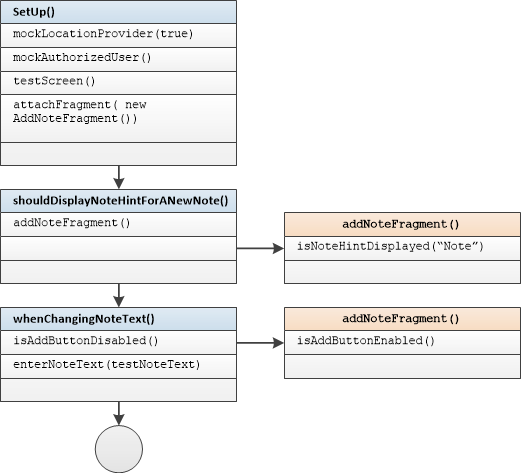
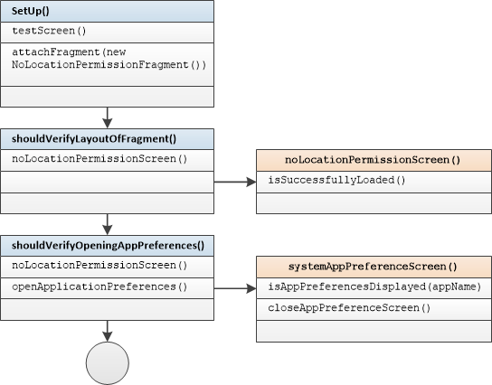
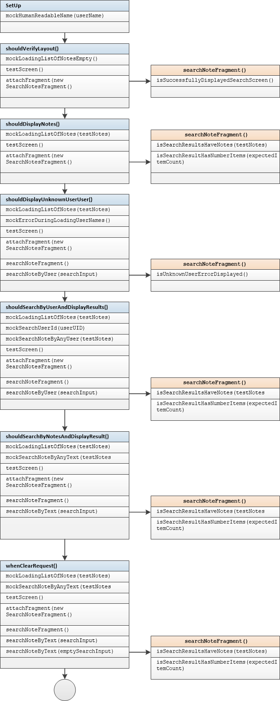

# Instrumentation Tests Guide

#### Introduction:

Instrumentation tests run on real device or emulator. They  extensively use mock instances of real objects. Instrumentation tests have been  created for activities and fragments.

Test method names include input and output action description

For example:

```
whenSignOutShouldOpenLoginScreen
```

- input 		sign out  done
- output	  login screen opens

#### Tested Activities:  

- SplashActivity, LoginActivity, SignInActivity, SignUpActivity, HomeActivity

#### Tested Fragments:

- AddNoteFragment,  NoLocationPermissionFragment,  SearchNotesFragment

#### Mock Dependency Inject Scheme:  

This application uses standard Component/Module dependency injection.

Test Application and User Test Runner are used in this implementation of instrumentation tests

Instrumentation Tests in master branch are based on "on-fly module replacement" scheme:

- SetUp method creates the anonymous class instance of IModuleSupply module supplier interface
- every method of  IModuleSupply returns Test Module that inherits real Module 
- methods of TestModule override @Provide methods and provide Mock objects instead of real
- IModuleSupplier instance is pushed into Application.
- When components are created, IModuleSupplier instance provides test modules for components

**SplashActivityTest dependency scheme example:**

1. Create Test Module with mock instances 
2. Create IModuleSupplier instance that provides Test Modules
3. Put IModuleSupplier instance to Test Application



#### SetUp() method

Every Instrumentation Test class inherits MockTest class.

SetUp() method of MockTest creates Test Modules , IModuleSupplier instance and injects it to TestMainApp 

This is the same for all Instrumentation Test Classes



### Instrumentation Tests for Activities  

#### SplashActivity Tests

```
    @Test
    public void whenUserIsAuthenticatedShouldOpenHomeActivity() {
    }

    @Test
    public void whenUserIsNotAuthenticatedShouldOpenHomeActivity() {
    }
```

 

See [source](../app/src/androidTest/java/ru/vpcb/map/notes/activity/splash/SplashActivityTest.java) for tests source code.

#### HomeActivity Tests

Test methods
```
    public void shouldVerifyAllTabs() {
    }

    @Test
    public void shouldVerifyAddNoteFragment() {
    }

    @Test
    public void shouldVerifySearchNoteFragment() {
    }

    @Test
    public void whenMovingFromAddTabShouldVerifyMapFragment() {
    }

    @Test
    public void whenSignOutShouldOpenLoginScreen() {
    }
```
Test scheme:
 

See [source](../app/src/androidTest/java/ru/vpcb/map/notes/activity/home/HomeActivityTest.java) for tests source code.

#### LoginActivity Tests

Test methods
```
    @Test
    public void whenClickToSignInButtonShouldLaunchSignInActivity() {
    }

    @Test
    public void whenClickToSignUpButtonShouldLaunchSignUpActivity() {
    }
```
Test scheme:
 

See [source](../app/src/androidTest/java/ru/vpcb/map/notes/activity/login/LoginActivityTest.java) for test source code.

#### SignInActivity Tests

Test methods

```
    @Test
    public void whenEmailIsEmptyShouldDisplayEmailError() {
    }

    @Test
    public void whenEmailIsNotCorrectShouldDisplayEmailError() {
    }

    @Test
    public void whenPasswordIsEmptyShouldDisplayPasswordError() {
    }

    @Test
    public void whenSignInErrorShouldDisplaySignInError() {
    }

    @Test
    public void whenSignInSuccessShouldOpenMapScreen() {
    }
```
Test scheme:

 

See [source](../app/src/androidTest/java/ru/vpcb/map/notes/activity/login/signin/SIgnInActivityTest.java) for test source code.

#### SignUpActivity Tests

Test methods:

```
    @Test
    public void whenEmailIsEmptyShouldDisplayEmailError() {
    }

    @Test
    public void whenEmailIsNotCorrectShouldDisplayEmailError() {
  
    }

    @Test
    public void whenPasswordIsEmptyShouldDisplayPasswordError() {
    }

    @Test
    public void whenNameIsEmptyShouldDisplayNameError() {
    }

    @Test
    public void whenSignUpErrorShouldDisplaySignUpError() {
    }

    @Test
    public void whenSignUpSuccessShouldOpenMapScreen() {
    }
```

Test scheme:

 

See [source](../app/src/androidTest/java/ru/vpcb/map/notes/activity/login/signup/SignUpActivityTest.java) for test source code.


### Instrumentation Tests for Fragments

#### AddNoteFragment Tests

Test methods:

```
    public void shouldDisplayNoteHintForANewNote() {
    }

    @Test
    public void shouldChangeAddButtonEnableAfterChangingNoteText() {
    }

```

Test scheme:




See [source](../app/src/androidTest/java/ru/vpcb/map/notes/fragments/add/AddNoteFragmentTest.java) for test source code.

#### NoLocationPermissionFragment Tests

Test methods:
```
    @Test
    public void shouldVerifyLayoutOfFragment() {
    }

    @Test
    public void shouldVerifyOpeningAppPreferences() {
    }

```
Test scheme:



See [source](../app/src/androidTest/java/ru/vpcb/map/notes/fragments/nopermissions/NoLocationPermissionFragmentTest.java) for test source code.

#### SearchNotesFragment Tests

Test methods:

```
    @Test
    public void shouldVerifyLayout() {
    }

    @Test
    public void shouldDisplayNotes() {
    }

    @Test
    public void shouldDisplayUnknownUserUser() {
    }

    @Test
    public void shouldSearchByUserAndDisplayResults() {
    }

    @Test
    public void shouldSearchByNotesAndDisplayResult() {
    }

    @Test
    public void whenClearRequestShouldSearchIncorrectDataAndDisplayCorrectData() {
    }

```

Test scheme:



See [source](../app/src/test/java/ru/vpcb/map/notes/fragments/search/SearchNotesFragmentTests.java) for test methods and  [search_notes_fragment_tests](instrumental/search_notes_fragment.md) for the description.


