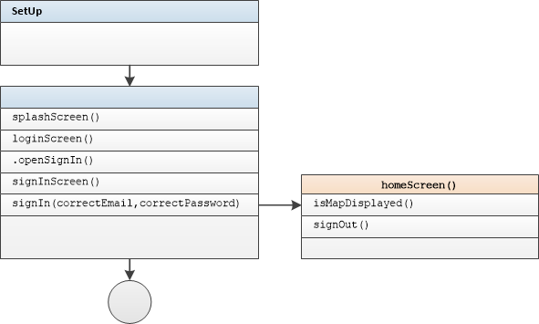
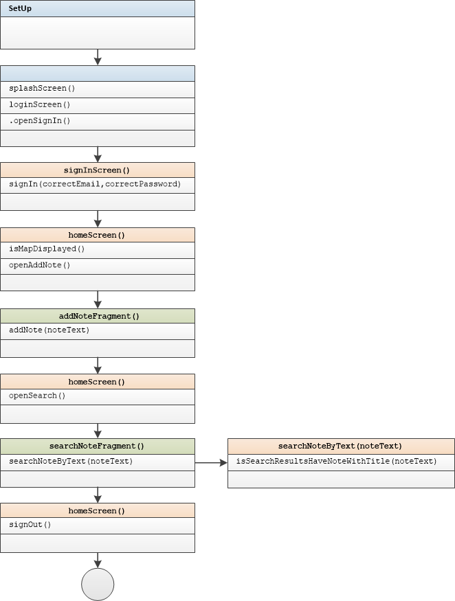

# Smoke Tests Guide Builders

#### Introduction:

Smoke tests are used to test application flows. They work on a real device or emulator. Smoke tests do not use dummy instances and test the application in a completely real environment.

Test method names include output action description

For example:

```
shouldVerifyAddingAndSearchNote
```

- output	  verification of add and search notes actions

**Attention:**  User with login= "test@test.com" and password = "test123" should be signed up to MapNotes Firebase Authentication Service <u>before</u> these tests.

#### Tested Flows:  

- Login Fail Flow
- Login Success Flow   

- Full Application Flow  

#### Run Smoke Tests  

Run Smoke Tests with RMB click on 'Run' [SmokeTests](app/src/androidTest/java/ru/vpcb/map/notes/SmokeTests.java) file.  

#### Login Failure Flow Test

Tested activities:	SplashActivity, LoginActivity, SignInActivity

Test method:

```
    @Test
    public void shouldVerifyFailureLogin() {
        splashScreen()
                .displayAsEntryPoint();
        homeScreen()
                .safeSignOut();
        loginScreen()
                .openSignIn();
        signInScreen()
                .signIn(correctEmail, incorrectPassword)
                .isSignInErrorDisplayed();
    }
    
```

 

See [source](../app/src/androidTest/java/ru/vpcb/map/notes/SmokeTests.java) for smoke tests source code.

#### Login Success Flow Test

Tested activities:	SplashActivity, LoginActivity, SignInActivity, HomeActivity

Test method:

```
    @Test
    public void shouldVerifySuccessfulLogin() {
        splashScreen()
                .displayAsEntryPoint();
        homeScreen()
                .safeSignOut();
        loginScreen()
                .openSignIn();
        signInScreen()
                .signIn(correctEmail, correctPassword);
        homeScreen()
                .isMapDisplayed()
                .signOut();
    }
    
```

 

See [source](../app/src/androidTest/java/ru/vpcb/map/notes/SmokeTests.java) for smoke tests source code.

#### Full Application Flow Test

Tested activities:	SplashActivity, LoginActivity, SignInActivity, HomeActivity, AddNoteFragment, SearchNotesFragment

**Attention:**  User with login= "test@test.com" and password = "test123" should be signed up to MapNotes Firebase Authentication Service <u>before</u> these tests.

Test method:

```
    @Test
    public void shouldVerifyAddingAndSearchNote() {
        SimpleDateFormat format = new SimpleDateFormat("dd-MM-yyyy HH-mm-ss");
        String noteText = format.format( Calendar.getInstance().getTime());
        splashScreen()
                .displayAsEntryPoint();
        homeScreen()
                .safeSignOut();
        loginScreen()
                .openSignIn();
        signInScreen()
                .signIn(correctEmail, correctPassword);
        homeScreen()
                .isMapDisplayed()
                .openAddNote();
        addNoteFragment()
                .addNote(noteText);
        homeScreen()
                .openSearch();
        searchNoteFragment()
                .searchNoteByText(noteText)
                .isSearchResultsHaveNoteWithTitle(noteText);
        homeScreen().
                signOut();
    }
```

 

See [source](../app/src/androidTest/java/ru/vpcb/map/notes/SmokeTests.java) for smoke tests source code.