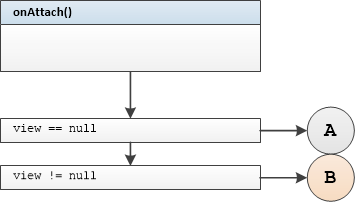
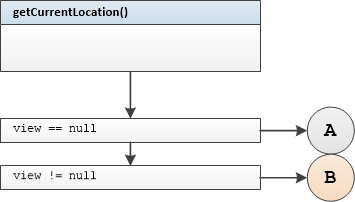
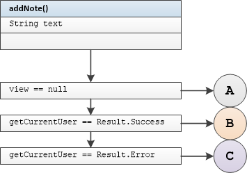

## AddNotePresenter Unit Tests

Tested Methods

-  onAttach()
-  getCurrentLocation()
-  addNote()
-  onDetach()

---

### <u>onAttach()</u>



#### Test group 0	

  branch B

```
onAttachWithNonNullViewStartLocationUpdatesCalled
```

	branch A 	view == null

```
onAttachWithNullViewStartLocationUpdatesNotCalled
```


### <u>getCurrentLocation()</u>



#### Test group 1

 
```
getCurrentLocationWithNonNullViewDisplayCurrentLocationCalled
```
 
```
getCurrentLocationWithNullViewDisplayCurrentLocationNotCalled
```
 
```
getCurrentLocationWithViewDetachedDisplayCurrentLocationCalled
```
### <u>addNote()</u>




#### Test group 2

 
```
addNoteUserAuthenticatedWithNonNullViewAddNoteCalled
```
 
```
addNoteUserAuthenticatedWithNullViewAddNoteNotCalled
```
 
```
addNoteUserAuthenticatedWithViewDetachedAddNoteNotCalled
```

#### Test group 3

 
```
addNoteUserNotAuthenticatedWithNonNullViewAddNoteNotCalled
```
 
```
addNoteUserNotAuthenticatedWithNullViewAddNoteNotCalled
```
 
```
addNoteUserNotAuthenticatedWithViewDetachedAddNoteNotCalled
```
### <u>onDetach()</u>


#### Test group 4

 
```
onDetachWithNonNullViewStartLocationUpdatesCalled
```
 
```
onDettachWithNullViewStartLocationUpdatesNotCalled
```

