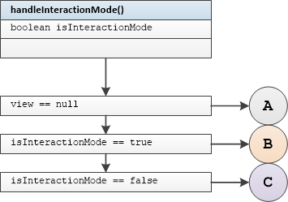
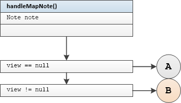
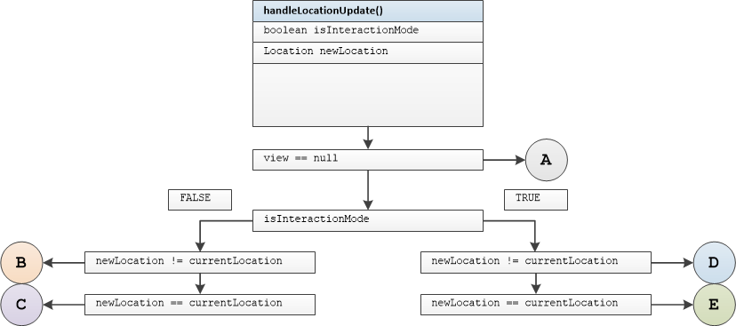
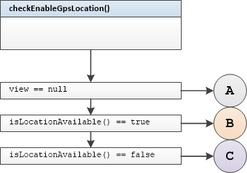
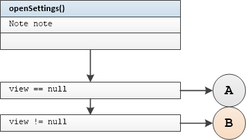
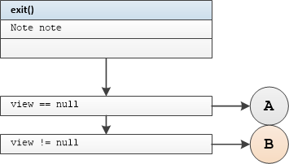

## GoogleMapPresenter Unit Tests

#### Tested Methods

-  handleInteractionMode()
-  handleMapNote()
-  handleLocationUpdate()
-  checkEnableGpsLocation()
-  openSettings()
-  exit()

---

### <u>handleInteractionMode()</u>



#### Test group 0	

	branch B

```
handleInteractionModeInteractionModeWithNonNullViewAnimateCameraNotCalled
```

	branch A 	view == null

```
handleInteractionModeInteractionModeWithNullViewAnimateCameraNotCalled
```

	branch A	view detached from presenter

```
handleInteractionModeInteractionModeWithViewDetachedAnimateCameraNotCalled
```

#### Test group 1

 

```
handleInteractionModeNotInteractionModeWithNonNullViewAnimateCameraCalled
```

 

```
handleInteractionModeNotInteractionModeWithNullViewAnimateCameraNotCalled
```

 
```
handleInteractionModeNotInteractionModeWithViewDetachedAnimateCameraNotCalled
```


### <u>handleMapNote()</u>



#### Test group 2	

  

```
handleMapNoteWithNonNullViewDisplayNoteOnMapCalled
```

	

```
handleMapNoteWithNullViewDisplayNoteOnMapNotCalled
```

	

```
handleMapNoteWithViewDetachedDisplayNoteOnMapNotCalled
```


### <u>handleLocationUpdate()</u>



#### Test group 3	

  

```
handleLocationUpdateNotInteractionModeNewLocationNotEqualsToCurrentWithNonNullViewAnimateCameraCalled
```

	

```
handleLocationUpdateNotInteractionModeNewLocationNotEqualsToCurrentWithNullViewAnimateCameraNotCalled
```

	

```
handleLocationUpdateNotInteractionModeNewLocationNotEqualsToCurrentWithViewDetachedAnimateCameraNotCalled
```

#### Test group 4

 

```
handleLocationUpdateNotInteractionModeNewLocationEqualsToCurrentWithNonNullViewAnimateCameraNotCalled
```

 

```
handleLocationUpdateNotInteractionModeNewLocationEqualsToCurrentWithNullViewAnimateCameraNotCalled
```

 
```
handleLocationUpdateNotInteractionModeNewLocationEqualsToCurrentWithViewDetachedAnimateCameraNotCalled
```

#### Test group 5

 

```
handleLocationUpdateInteractionModeNewLocationNotEqualsToCurrentWithNonNullViewAnimateCameraNotCalled
```

 

```
handleLocationUpdateInteractionModeNewLocationNotEqualsToCurrentWithNullViewAnimateCameraNotCalled
```

  

```
handleLocationUpdateInteractionModeNewLocationNotEqualsToCurrentWithViewDetachedAnimateCameraNotCalled
```

#### Test group 6

 
```
handleLocationUpdateInteractionModeNewLocationEqualsToCurrentWithNonNullViewAnimateCameraNotCalled
```
 
```
handleLocationUpdateInteractionModeNewLocationEqualsToCurrentWithNullViewAnimateCameraNotCalled
```
 
```
handleLocationUpdateInteractionModeNewLocationEqualsToCurrentWithViewDetachedAnimateCameraNotCalled
```


### <u>checkEnableGpsLocation()</u>



#### Test group 7	

  

```
checkEnableGpsLocationLocationAvailableWithNonNullViewShowLocationAlertDialogNotCalled
```

	

```
checkEnableGpsLocationLocationAvailableWithNullViewShowLocationAlertDialogNotCalled
```

	

```
checkEnableGpsLocationLocationAvailableWithViewDetachedShowLocationAlertDialogNotCalled
```

#### Test group 8

 

```
checkEnableGpsLocationLocationNotAvailableWithNonNullViewShowLocationAlertDialogCalled
```

 

```
checkEnableGpsLocationLocationNotAvailableWithNullViewShowLocationAlertDialogNotCalled
```

 
```
checkEnableGpsLocationLocationNotAvailableWithViewDetachedShowLocationAlertDialogNotCalled
```


### <u>openSettings()</u>



#### Test group 9	

  

```
openSettingsWithNonNullViewOpenSettingsCalled
```

	

```
openSettingsWithNullViewOpenSettingsNotCalled
```

	

```
openSettingsWithViewDetachedOpenSettingsNotCalled
```


### <u>exit()</u>



#### Test group 10	

  branch B

```
exitWithNonNullViewExitCalled
```

	branch A 	view == null

```
exitWithNullViewExitNotCalled
```

	branch A	view detached from presenter

```
exitWithViewDetachedExitCalled
```


