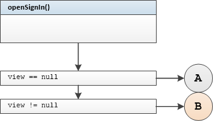

## LoginPresenter Unit Tests

#### Tested Methods

-  openSignIn()
- openSignUp()

---

### <u>openSignIn()</u>

 

#### Test group 0	

  branch B

```
openSignInWithNonNullViewNavigateToSignInCalled
```

	branch A 	view == null

```
openSignInWithNullViewNavigateToSignInNotCalled
```

	branch A	view detached from presenter

```
openSignInWithViewDetachedNavigateToSignInNotCalled
```


### <u>openSignUp()</u>

 

#### Test group 1

 

```
openSignUpWithNonNullViewNavigateToSignUpCalled
```

 

```
openSignUpWithNullViewNavigateToSignUpNotCalled
```

 

```
openSignUpWithViewDetachedNavigateToSignUpNotCalled
```

