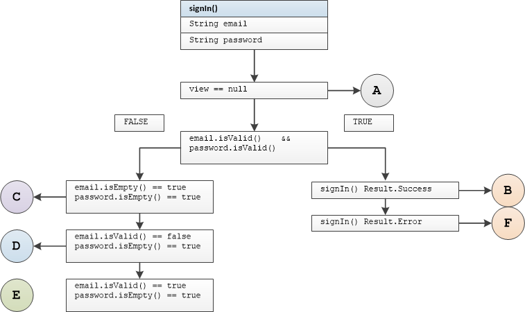

## SignInPresenter Unit Tests

#### Tested Methods

-  signIn()

---

### <u>signIn()</u>



#### Test group 0	

  branch B

```
singInWithCorrectEmailPasswordWithNonNullViewNavigateToMapScreenCalled
```

	branch A 	view == null

```
singInWithCorrectEmailPasswordWithNullViewNavigateToMapScreenNotCalled
```

	branch A	view detached from presenter

```
singInWithCorrectEmailPasswordWithViewDetachedNavigateToMapScreenNotCalled
```

#### Test group 1

 

```
singInWithEmptyEmailPasswordWithNonNullViewDisplayEmailErrorCalled
```

 

```
singInWithEmptyEmailPasswordWithNullViewDisplayEmailErrorNotCalled
```

 

```
singInWithEmptyEmailPasswordWithViewDetachedDisplayEmailErrorNotCalled
```

#### Test group 2

 

```
singInWithIncorrectEmailEmptyPasswordWithNonNullViewDisplayEmailErrorCalled
```

 

```
singInWithIncorrectEmailEmptyPasswordWithNullViewDisplayEmailErrorNotCalled
```

  

```
singInWithIncorrectEmailEmptyPasswordWithViewDetachedDisplayEmailErrorNotCalled
```

#### Test group 3

 

```
singInWithCorrectEmailEmptyPasswordWithNonNullViewDisplayPasswordErrorCalled
```

 

```
singInWithCorrectEmailEmptyPasswordWithNullViewDisplayPasswordErrorNotCalled
```

 

```
singInWithCorrectEmailEmptyPasswordWithViewDetachedDisplayPasswordErrorNotCalled
```

#### Test group 4

 
```
singInWithCorrectEmailIncorrectPasswordWithNonNullViewDisplaySignInErrorCalled
```
 
```
singInWithCorrectEmailIncorrectPasswordWithNullViewDisplaySignInErrorNotCalled
```
 
```
singInWithCorrectEmailIncorrectPasswordWithViewDetachedToPresenterDisplaySignInErrorNotCalled
```


