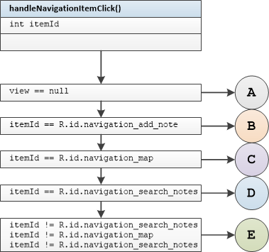
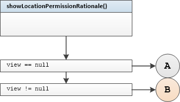
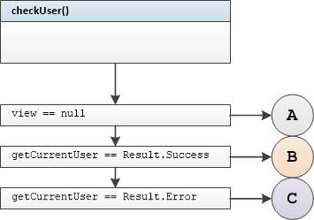
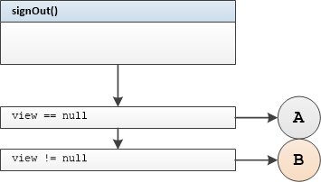

## HomePresenter Unit Tests

#### Tested Methods


-  handleNavigationItemClick()
-  showLocationPermissionRationale()
-  showLocationRequirePermissions()
-  checkUser()
-  signOut()


### <u>handleNavigationItemClick()</u>



#### Test group 0	

  branch B

```
handleNavigationItemClickNavigationAddNoteWithNonNullViewDisplayAddNoteCalledReturnTrue
```

	branch A 	view == null

```
handleNavigationItemClickNavigationAddNoteWithNullViewDisplayAddNoteNotCalledReturnFalse
```

	branch A	view detached from presenter

```
handleNavigationItemClickNavigationAddNoteWithViewDetachedDisplayAddNoteNotCalledReturnFalse
```

#### Test group 1

 

```
handleNavigationItemClickNavigationMapWithNonNullViewUpdateNavigationStateCalledReturnTrue
```

 

```
handleNavigationItemClickNavigationMapWithNullViewUpdateNavigationStateNotCalledReturnFalse
```

 

```
handleNavigationItemClickNavigationMapWithViewDetachedUpdateNavigationStateNotCalledReturnFalse
```

#### Test group 2

 

```
handleNavigationItemClickNavigationSearchNotesWithNonNullViewDisplaySearchNotesCalledReturnTrue
```

 

```
handleNavigationItemClickNavigationSearchNotesWithNullViewDisplaySearchNotesNotCalledReturnFalse
```

  

```
handleNavigationItemClickNavigationSearchNotesWithViewDetachedDisplaySearchNotesNotCalledReturnFalse
```
#### Test group3

 

```
handleNavigationItemClickUnknownResourceWithNonNullViewThrowIllegalArgumentException
```

 

```
handleNavigationItemClickUnknownResourceWithNullViewNotThrowIllegalArgumentExceptionReturnFalse
```

  

```
showLocationPermissionRationaleWithNonNullViewShowPermissionExplanationSnackBarCalled
```


### <u>showLocationPermissionRationale()</u>



#### Test group 4

 
```
showLocationPermissionRationaleWithNonNullViewShowPermissionExplanationSnackBarCalled
```
 
```
showLocationPermissionRationaleWithNullViewShowPermissionExplanationSnackBarNotCalled
```
 
```
showLocationPermissionRationaleWithViewDetachedShowPermissionExplanationSnackBarNotCalled
```


### <u>showLocationRequirePermissions()</u>


#### Test group 5

 
```
showLocationRequirePermissionsWithNonNullViewShowContentWhichRequirePermissionsCalled
```
 
```
showLocationRequirePermissionsWithNullViewShowContentWhichRequirePermissionsNotCalled
```
 
```
showLocationRequirePermissionsWithViewDetachedShowContentWhichRequirePermissionsNotCalled
```


### <u>checkUser()</u>



#### Test group 6

 
```
checkUserUserAuthenticatedWithNonNullViewNavigateToLoginScreenNotCalled
```
 
```
checkUserUserAuthenticatedWithNullViewNavigateToLoginScreenNotCalled
```
 
```
checkUserUserAuthenticatedWithViewDetachedNavigateToLoginScreenNotCalled
```

#### Test group 7

 
```
checkUserUserNotAuthenticatedWithNonNullViewNavigateToLoginScreenCalled
```
 
```
checkUserUserNotAuthenticatedWithNullViewNavigateToLoginScreenNotCalled
```
 
```
checkUserUserNotAuthenticatedWithViewDetachedNavigateToLoginScreenNotCalled
```

### <u>signOut()</u>



#### Test group 8

 
```
signOutWithNonNullViewSignOutCalled
```
 
```
signOutWithNullViewSignOutNotCalled
```
 
```
signOutWithViewDetachedSignOutNotCalled
```

