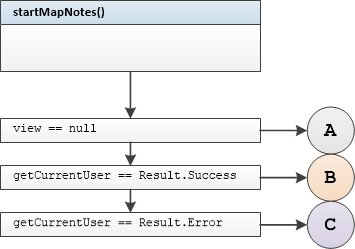
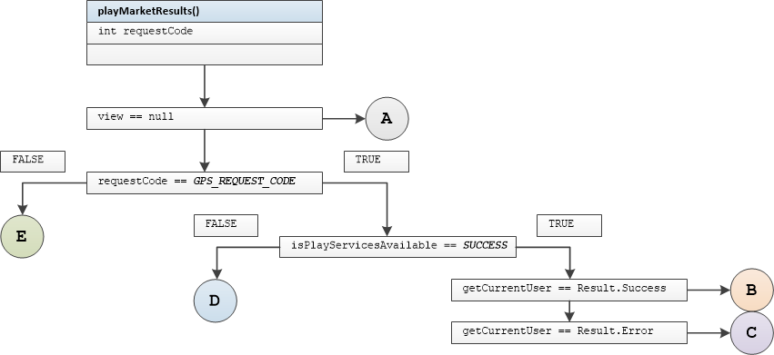
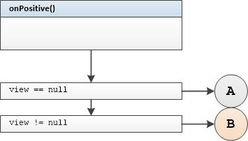
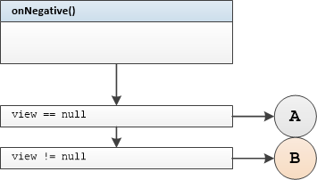

## SplashPresenter Unit Tests

#### Tested Methods

-  start()
- startMapNotes()
- playMarketResults()
- onPositive()
- onNegative()

### <u>start()</u>


#### Test group 0	

  branch B

```
startWithPlayServicesAvailableUserAuthenticatedNonNullViewNavigateToHomeCalled
```

	branch A 	view == null

```
startWithPlayServicesAvailableUserAuthenticatedNullViewStartNavigateToHomeNotCalled
```

	branch A	view detached from presenter

```
startWithPlayServicesAvailableUserAuthenticatedWithViewDetachedNavigateToHomeNotCalled
```

#### Test group 1

 

```
startWithPlayServicesAvailableUserNotAuthenticatedNonNullViewNavigateToLoginCalled
```

 

```
startWithPlayServicesAvailableUserNotAuthenticatedNullViewNavigateToLoginNotCalled
```

 

```
startWithPlayServicesAvailableUserNotAuthenticatedWithViewDetachedNavigateToLoginNotCalled
```

#### Test group 2

 

```
startWithPlayServicesNotAvailablePlayMarketInstalledNonNullViewGetErrorDialog
```

 

```
startWithPlayServicesNotAvailablePlayMarketInstalledNullViewViewGetErrorDialogNotCalled
```

  

```
startWithPlayServicesNotAvailablePlayMarketInstalledWithViewDetachedViewGetErrorDialogNotCalled
```

#### Test group 3

 

```
startWithPlayServicesNotAvailablePlayMarketNotInstalledNonNullViewGetAlertDialog
```

 

```
startWithPlayServicesNotAvailablePlayMarketNotInstalledNullViewGetAlertDialogNotCalled
```

 

```
startWithPlayServicesNotAvailablePlayMarketNotInstalledWithViewDetachedGetAlertDialogNotCalled
```


### <u>startmapNotes()</u>




#### Test group 4

 

```
startMapNotesWithUserAuthenticatedWithNonNullViewNavigateToHomeCalled
```

 

```
startMapNotesWithUserAuthenticatedWithNullViewNavigateToHomeNotCalled
```

 

```
startMapNotesWithUserAuthenticatedWithViewDetachedNavigateToHomeNotCalled
```

#### Test group 5

 

```
startMapNotesWithUserNotAuthenticatedWithNonNullViewNavigateToLoginCalled
```

 

```
startMapNotesWithUserNotAuthenticatedWithNonNullViewNavigateToLoginCalled
```

   

```
startMapNotesWithUserNotAuthenticatedWithNullViewNavigateToLoginNotCalled
```


### <u>playMarketResults()</u>




#### Test group 6

 

```
playMarketResultsWithGPSRequestCodeUserAuthenticatedPlayServiceAvailableWithNonNullViewNavigateToHomeCalled
```

 

```
playMarketResultsWithGPSRequestCodeUserAuthenticatedPlayServiceAvailableWithNullViewNavigateToHomeNotCalled
```

 

```
playMarketResultsWithGPSRequestCodeUserAuthenticatedPlayServiceAvailableWithViewDetachedNavigateToHomeNotCalled
```

#### Test group 7

 

```
playMarketResultsWithRequestGPSRequestCodeUserNotAuthenticatedPlayServiceAvailableWithNonNullViewNavigateToLoginCalled
```

 

```
playMarketResultsWithGPSRequestCodeUserNotAuthenticatedPlayServiceAvailableWithNullViewNavigateToLoginCalledNotCalled
```

 

```
playMarketResultsWithGPSRequestCodeUserNotAuthenticatedPlayServiceAvailableWithViewDetachedNavigateToLoginCalledNotCalled
```

#### Test group 8

 

```
playMarketResultsWithGPSRequestCodePlayServiceNotAvailableWithNonNullViewFinishActivityCalled
```

 

```
playMarketResultsWithGPSRequestCodePlayServiceNotAvailableWithNullViewFinishActivityNotCalled
```

 

```
playMarketResultsWithGPSRequestCodePlayServiceNotAvailableWithViewDetachedFinishActivityNotCalled
```

#### Test group 9

 

```
playMarketResultsWithNotGPSRequestCodeWithNonNullViewFinishActivityCalled
```

 

```
playMarketResultsWithNotGPSRequestCodeWithNullViewFinishActivityNotCalled
```

 

```
playMarketResultsWithNotGPSRequestCodeWithViewDetachedFinishActivityNotCalled
```


### <u>onPositive()</u>




#### Test group 10

 

```
onPositiveWithNonNullViewNavigateToPlayMarketCalled
```

 

```
onPositiveWithNullViewNavigateToPlayMarketNotCalled
```

 

```
onPositiveWithViewDetachedNavigateToPlayMarketNotCalled
```


### <u>onNegative()</u>




#### Test group 11

 

```
onNegativeWithNonNullViewFinishActivityCalled
```

 

```
onNegativeWithNullViewFinishActivityNotCalled
```

 

```
onNegativeWithViewDetachedFinishActivityNotCalled
```

