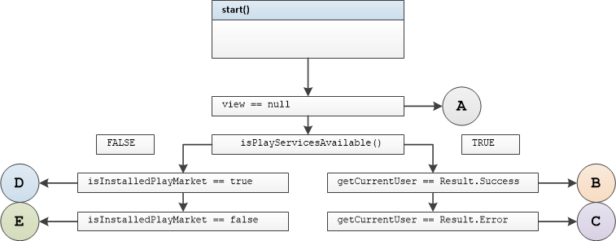

# Unit Tests Guide

Unit tests used for local testing on JVM to verify that the login of individual units is correct.

Unit tests  written for activity presenters, fragment presenters, and user classes.

Methods in unit tests have comments with group /method number, method name and condition

Test method names include tested method name, input parameters and output result descriptions

For example:

```
startWithPlayServicesAvailableUserNotAuthenticatedNonNullViewNavigateToLoginCalled
```

- method name 		start()

- playServices			available

- user					 	not authenticated

- view						non null

- result		       		navigateToLogin() method called

Tested Activity Presenters:  

- SplashPresenter, LoginPresenter,SignInPresenter, SignUpPresenter, HomePresenter
- Every method tested with  three variants  of view that represents AppCompatActivity
  - view is non null
  - view is null
  - view is non null but detached from presenters

Tested Fragment Presenters:

- AddNotePresenter, GoogleMapPresenter, SearchNotesPresenter
- Every method tested with  three variants of view, that represents Fragment Activity
  - view is non null
  - view is null
  - view is non null but detached from presenters

Tested user classes:

- ValidationExt, CoordinateFormatter


## SplashPresenter

Tested Methods

-  start()
- startMapNotes()
- playMarketResults()
- onPositive()
- onNegative()

### <u>start()</u>



#### Test group 0	

branch	B

```
startWithPlayServicesAvailableUserAuthenticatedNonNullViewNavigateToHomeCalled
```

branch	A	view == null

```
startWithPlayServicesAvailableUserAuthenticatedNullViewStartNavigateToHomeNotCalled
```

branch	A	view detached from presenter

```
startWithPlayServicesAvailableUserAuthenticatedWithViewDetachedNavigateToHomeNotCalled
```

#### Test group 1

branch	C

```
startWithPlayServicesAvailableUserNotAuthenticatedNonNullViewNavigateToLoginCalled
```

branch	A

```
startWithPlayServicesAvailableUserNotAuthenticatedNullViewNavigateToLoginNotCalled
```

branch	A

```
startWithPlayServicesAvailableUserNotAuthenticatedWithViewDetachedNavigateToLoginNotCalled
```

#### Test group 2

branch	D

```
startWithPlayServicesNotAvailablePlayMarketInstalledNonNullViewGetErrorDialog
```

branch 	A

```
startWithPlayServicesNotAvailablePlayMarketInstalledNullViewViewGetErrorDialogNotCalled
```

branch 	A

```
startWithPlayServicesNotAvailablePlayMarketInstalledWithViewDetachedViewGetErrorDialogNotCalled
```

#### Test group 3

branch	E

```
startWithPlayServicesNotAvailablePlayMarketNotInstalledNonNullViewGetAlertDialog
```

branch 	A

```
startWithPlayServicesNotAvailablePlayMarketNotInstalledNullViewGetAlertDialogNotCalled
```

branch 	A

```
startWithPlayServicesNotAvailablePlayMarketNotInstalledWithViewDetachedGetAlertDialogNotCalled
```

### <u>startmapNotes()</u>

TBD


#### Test group 4

branch	B

branch 	A

branch 	A


#### Test group 5

branch	C

branch 	A

branch 	A


#### Test group 6

branch	D

branch 	A

branch 	A


#### Test group 7

branch	E

branch 	A

branch 	A

#### Test group 8

branch	C

branch 	A

branch 	A