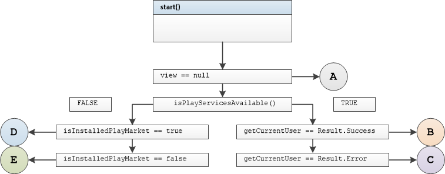
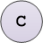
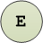

## ValidationExt Unit Tests

#### Tested Methods

-  isValidEmail()

### <u>isValidEmail()</u>



#### Test group 0	

  branch B

```

```

	branch A 	view == null

```

```

	branch A	view detached from presenter

```

```

#### Test group 1

 

```

```

 

```

```

 

```

```

#### Test group 2

 

```

```

 

```

```

  

```

```

#### Test group 3

 
```

```
 
```

```
 
```

```

#### Test group 4

 
```

```
 
```

```
 
```

```

#### Test group 5

 
```

```
 
```

```
 
```

```

#### Test group 6

 
```

```
 
```

```
 
```

```

#### Test group 7

 
```

```
 
```

```
 
```

```

#### Test group 8

 
```

```
 
```

```
 
```

```

#### Test group 9

 
```

```
 
```

```
 
```

```

#### Test group 10

 
```

```
 
```

```
 
```

```

#### Test group 11

 
```

```
 
```

```
 
```

```

#### Test group 12

 
```

```
 
```

```
 
```

```


