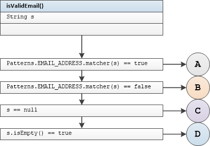

## ValidationExt Unit Tests

#### Tested Methods

-  isValidEmail()

---

### <u>isValidEmail()</u>



 	branch A  	input matches pattern

```
isValidEmailInputMatchesPatternReturnTrue
```

	branch B 	input not matches pattern

```
isValidEmailInputNotMatchesPatternReturnFalse
```

	branch C 	null input

```
isValidEmailNullInputReturnFalse
```

  	branch D 	input is empty

```
isValidEmailEmptyInputReturnFalse
```
